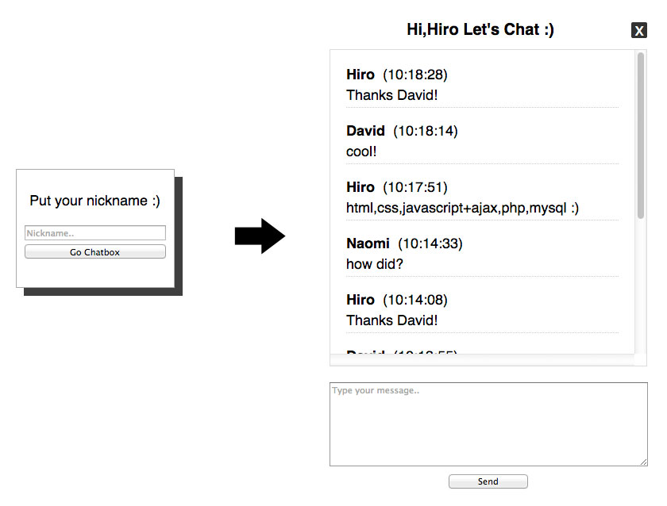

# Simple chat room
===================

***
## How to play?
  1. go to <http://hirokazunakajima.com/chat/>
  2. put your username whatever you want you're gonna use
  3. just enjoy ( you can not delete your message, so be careful )
  4. only 10 latest messages will be shown
  4. press X button placed right top to get out from this chat room

## What is it working in behind?

1. When you click __Go Chatbox__ button, your name is gonna be saved into __session__
2. When you send your message, it will be stored into database with your __Nickname__, __IP address__ and __session ID__
4. Then to update all message on chat box, `getMessage()` will be called (javascript)
5. XML format data is created from database through `chatroom-handler.php`
6. Retrieving XML data inside `getMessage()`, then get __content__, __nickname__ and __date__
7. Your message will be shown on top of chat box area
8. When you click __X__ button placed right top, your session is cleared and take you to first page ( Put your nickname page )  
  _* This chat box keeps updating every 1 sec using `setInterval()`_

